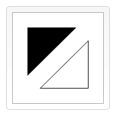

<!-- 学习 canvas -->

## 线

绘制直线，需要用到的方法 lineTo()。

```js
lineTo(x, y);
// 绘制一条从当前位置到指定x以及y位置的直线。
```

该方法有两个参数：x 以及 y ，代表坐标系中直线结束的点。

开始点和之前的绘制路径有关，之前路径的结束点就是接下来的开始点，开始点也可以通过 moveTo()函数改变。

## 绘制两个三角形



你会注意到填充与描边三角形步骤有所不同。正如上面所提到的，因为路径使用填充（fill）时，路径自动闭合，使用描边（stroke）则不会闭合路径。如果没有添加闭合路径closePath()到描述三角形函数中，则只绘制了两条线段，并不是一个完整的三角形。
