# 选择一个适合使用的图表库

## AntV/G2

### 背景

目前市面上有层出不穷的图表库，如果在 github 上搜 「chart」，会得到 48000 个左右相关的 Repository，这篇[文章](https://cssauthor.com/javascript-charting-libraries/) 列举了主流的图表库，通过 [npm-charts](https://npmcharts.com/) 工具可以看到部分图表库的 `npm downloads` 情况:

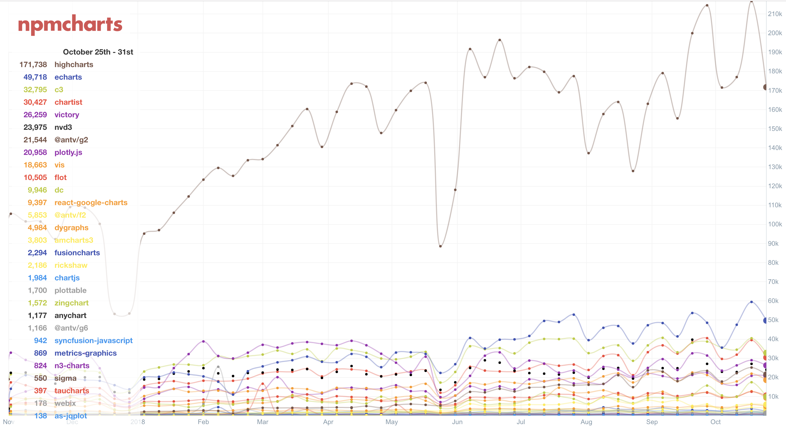

在这种情况下，蚂蚁金服团队于 2017 年 11 月 22 号 开源了一款号称是「简单 全面 强大 灵活」的图表库 AntV/G2，作者在 [AntV 3.0 — 三生万物](https://antv.alipay.com/zh-cn/vis/blog/antv-3.0-releasing.html) 一文中描述了发布内容，AntV/G2 的发布让我们又多了一个图表库的选择。

AntV 是蚂蚁金服团队研发的一套数据可视化解决方案，包含了「G2 可视化图形语法」「G6 关系数据可视化」、「F2 移动端可视化解决方案」。其中 G2 的含义是《The Grammar of Graphics》的 Graphics Grammar，《The Grammar of Graphics》 是计算机学家 [Leland Wilkinson](https://en.wikipedia.org/wiki/Leland_Wilkinson) 在研发一套统计图形绘图工具 [GPL](http://www.unige.ch/ses/sococ/cl/spss/graph/gpl.html) 时编写的一本书。

G2 是书中「图形语法」思想的还原和实现，相比较于传统的 charts，G2 有以下特点:

* 图形语法
* 集成大量数据处理和统计工具
* 大量的语法元素事件，方便开发高交互图表组件

### 图形语法

> 图形语法能让我们简洁地描述图形组件，这种语法能使我们超越命名图形（比如散点图），更深入的理解统计图形的层次结构。 - Hadley Wickham(ggplot2作者)

计算图形学的快速发展，可视化图表越来越多。「如何能以比较小的代价穷举尽可能多的图形」、「如何表示可视化图表的问题」亟待解决。在这样的背景下诞生了「图形语法」。它是一套用来描述所有统计图形深层特性的语法规则，该语法也回答了「什么是图形」的问题。
在「图形语法」之外，当遇到大量的图表时，依靠枚举的方式收集每一种可视化图形来解决。图形语法带来的不同之处在于，不是去枚举图表，而是像堆积木一样，通过组合不同的绘图过程的语法元素，来得到不同的可视化图表。
在 SEE Conf 2018 上，作者也进行了相关内容的分享: [AntV，返璞归真幻化万千可视化表达](https://zhuanlan.zhihu.com/p/32178892)。


##### 示例

基于 G2 的图形语法按照以下四个步骤就可以画一个柱状图:
  1. 创建 Chart 图表对象，指定图表所在的容器 ID、指定图表的宽高等信息
  2. 载入图表数据源
  3. 使用图形语法进行图表的绘制
  4. 渲染图表

```
const data = [
  { genre: 'Sports', sold: 275 },
  { genre: 'Strategy', sold: 115 },
  { genre: 'Action', sold: 120 },
  { genre: 'Shooter', sold: 350 },
  { genre: 'Other', sold: 159 }
]
const chart = new G2.Chart({
  container: 'app',
  width: 800,
  height: 300,
  forceFit: true,
  animate: true,
  renderer: 'svg'
})
chart.source(data)
chart.interval().position('genre*sold').color('genre')
chart.render()
```
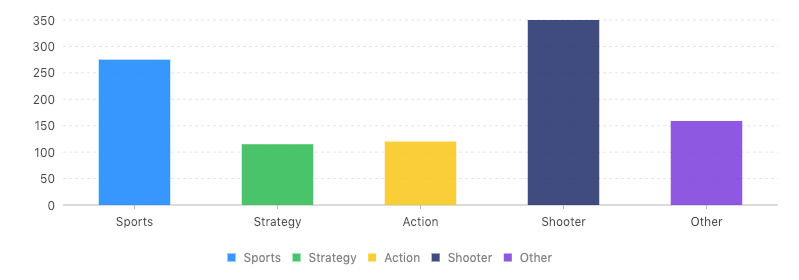

如果将 `chart.interval().position('genre*sold').color('genre')` 替换为 `chart.line().position('genre*sold')`，其他维持不变，就可以实现一个折线图:
```
...
 // chart.interval().position('genre*sold').color('genre')
 // replace
 chart.line().position('genre*sold')
...
```
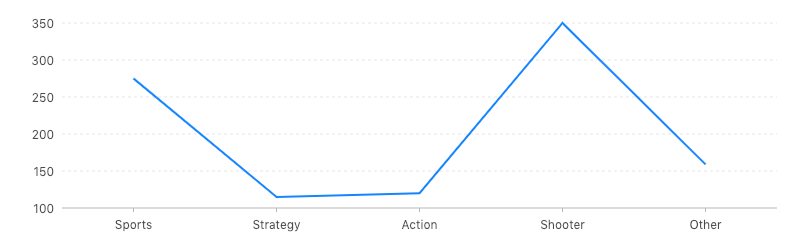

在这个示例中，两个图形的变化的实现，仅仅是通过几何标记 interval 和 line 之间的微调就实现了，也就是说任何一个基础语法的微调都可以得到不同的结果。所以基于图形语法画图更加灵活和可控。

相关文档: [图形语法简介](https://antv.alipay.com/zh-cn/g2/3.x/tutorial/the-grammar-of-graphics.html)

### 数据处理能力

一个可视化内容的产生过程就是数据空间到图形空间的映射过程。

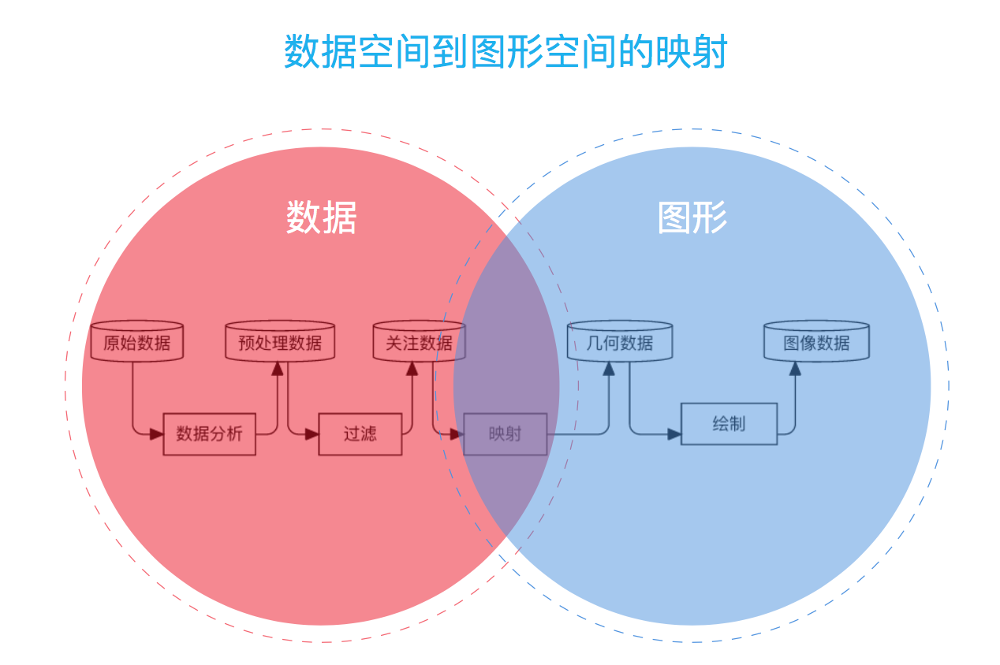

AntV 在数据空间方面，提供了 DataSet 为数据可视化场景提供了状态驱动。

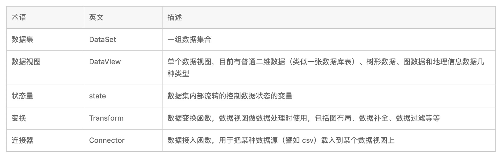

* 在获取数据方面，提供了 Connector 数据连接功能，可以导入 csv、tsv、GeoJSON 等多种类型的数据。
* 在数据处理方面，提供了 Transform 模块，内置了数据过滤、加工、排序、补全、聚合、统计等处理函数可以进行数据处理和转换。
* 提供了 state 状态量，作为 DataSet 数据集的内部变量，可以在多个 DateView 中通过状态共享，实现图表的联动等交互。

##### 示例

使用 DataSet 绘制图表:
  1. 基于 Connector 导入 testCSV 数据
  2. 使用 Transform map 函数进行数据处理
  3. 创建 Chart 图表对象，指定图表所在的容器 ID 等信息
  4. 载入图表数据源
  5. 使用图形语法进行图表的绘制
  6. 渲染图表

```
const testCSV = `genre,sold,number
Sports,270,1
Strategy,90,2
Action,320,3
Shooter,130,4`

const ds = new DataSet({
  state: {
    sold: 200
  }
})
const dv = ds.createView().source(testCSV, {
  type: 'csv'
})
dv.transform({
  type: 'map',
  callback(row) {
    return {...row, sold: parseInt(row.sold, 10)}
  }
})
const chart = new G2.Chart({
  container: 'app',
  width: 800,
  forceFit: true,
})
chart.source(dv)
chart.interval().position('genre*sold').color('genre')
chart.render()
```


相关文档: [DataSet](https://antv.alipay.com/zh-cn/g2/3.x/tutorial/data-set.html)

### 事件

G2 绘制的图表是通过基础的语法元素组合起来的，其支持开放了各种元素事件。

1. 画布基础事件，如 mousedown click dblclick 等
```
chart.on('mousedown', ev => {});
chart.on('click', ev => {});
...
```
2. 绘图区域事件，如 plotmove plotclick 等
```
chart.on('plotenter', ev => {});
chart.on('plotclick', ev => {});
...
```

3. tooltip 事件
```
chart.on('tooltip:show', ev => {}); // tooltip 展示
chart.on('tooltip:hide', ev => {}); // tooltip 隐藏
...
```

4. 图形元素事件，即组成图表的各种图形元素； 以 『图形元素名』+ 『基础事件名』 的方式来组合图形元素上的事件
```
chart.on('point:click', ev => {});
chart.on('axis-label:click', ev => {});
```
AntV 基于基础元素，丰富的事件支持，方便于开发丰富的高交互的图表组件。

相关文档: [AntV 图表事件](https://antv.alipay.com/zh-cn/g2/3.x/tutorial/chart-event.html)

## Echarts

自从 2013 年 6 月，ECharts 发布 1.0 版本，到 2018 年 1 月 16 日，ECharts 4.0 的问世，echarts 共迭代了 70 多个版本，Github 关注数达到超过 30000，是国内目前最流行的图表库。

通过 Echarts 通过对象配置的方式能够非常简单的实现一个可视化图表，使用起来非常简单，就不过多赘述了，如下示例:

#### 示例

```
const Chart = echarts.init(document.getElementById('app'))
option = {
  xAxis: {
    type: 'category',
    data: ['Sports', 'Strategy', 'Action', 'Shooter', 'Other']
  },
  yAxis: {
    type: 'value'
  },
  series: [{
    data: [275, 115, 120, 350, 159],
    type: 'bar'
  }]
}
Chart.setOption(option)
```

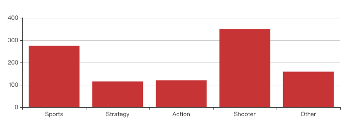

Echart 是我们比较熟悉的图表库，ECharts 4.0 的发布带来了比较大的改变。 [官网](http://echarts.baidu.com/feature.html) 上比较详细的介绍了几大特性，主要有以下几点:

* 丰富的可视化图表类型
* 支持了 DataSet
* 支持 Canvas、SVG（4.0+）、VML 渲染，可以在 PC / 移动端 使用
* 对 3D 的良好支持
* 无障碍访问

### 多渲染方案

HTML5 提供了 Canvas 和 SVG 两种绘图技术，在面临图表库的技术选型时，选择 Canvas 还是 SVG，总是会有些纠结。

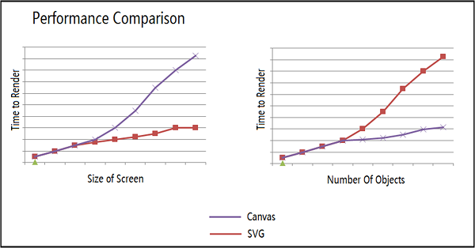

从微软 MSDN 上给的一个对比图来看，Canvas 的性能受画布尺寸影响更大，而 SVG 的性能受图形元素个数影响更大。所以，选择 Canvas 和 SVG 各有千秋。小画布、大数据量的场景适合用 Canvas，譬如热力图、大数据量的散点图等。如果画布非常大，有缩放、平移等高频的交互，或者移动端对内存占用量非常敏感等场景，可以使用 SVG 的方案。

G2 从 3.2.7 版本开始，支持了 Chart 级别切换 SVG 渲染，默认使用 Canvas 渲染，可以设置 `renderer` 进行切换:
```
const chart = new G2.Chart({
  // ...
  renderer: 'svg'
})
```

Echarts 在 4.0 版本也支持了多渲染方案，初始化图表实例时，传入参数 选择渲染器类型:
```
echarts.init(container, null, {renderer: 'svg'}) // svg, canvas
```

相关文档: [选择 Canvas 还是 SVG](https://antv.alipay.com/zh-cn/g2/3.x/tutorial/renderers.html)

## 如何选择

最重要的是需要了解项目的需要，然后对比市面上的图表库，进行按需选择。

选择图表库一般需要关注以下几点:

* 图表库在 github 上的维护情况
* 支持的图表类型（2D、3D、map、scientific, financial, and statistical charting）
* 定制化的能力 (titles, legends, zoom, tooltip, responsiveness)
* 图表库的样式风格

### Github 活跃度

通过 github 的数据指标能反应一个项目的流行度和活跃度，进一步反应着这个项目的发展情况。
多数情况下，优秀的开源项目会得到很好的维护，以及不断的发布新功能。

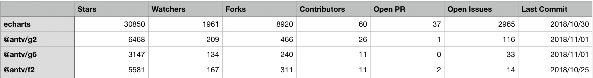

从日期截止到 2018 年 11 月 2 日的图表来看，echarts 的 stars、watchers、forks、contributors 等指标均远大于 AntV，考虑到 echarts 的发布时间较早，但是有一定的先发优势是正常的。AntV 在一年的时间里也是有着比较快的发展，但是在社区运营方面与 echarts 还存在一定的差距。

### 支持的图表类型

图表类型大概可以分为七类:

* 基本类: 线图(line), 柱状图(bar), 环图/饼图(donut/pie), 散点图(scatter plot), 气泡图(bubble), 面积图(area charts)
* 科学类: 等高线图(carpet plot), 热力图(carpet plot), 极坐标图(polar graph), 地毯图(carpet plot), 平行坐标图(parallel coordinates plot)
* 金融类: 时间序列图(time series), K线图(candlesticks)
* 统计类: 误差线图(error bars), 箱线图(box plots), 2D 密度图(2D density plots), 矩形树图(tree map)
* 3D: 点云图(point cloud), 折线图(line), 带状图(ribbon), 曲面图(surface),散点图(scatter)
* 地图: 气泡地图(bubble maps), 分级统计地图(choropleth maps), 散点地图(scatter plot on maps), 地图线路图(line on maps)

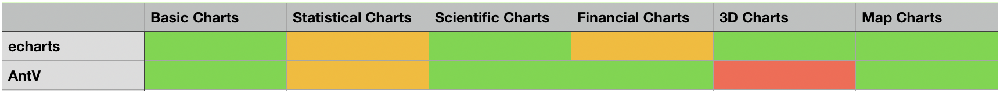
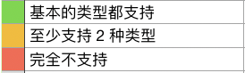

如图所示，AntV 和 Echarts 支持大多数常用图形的绘制，仅仅在 3D 图形方面，AntV 目前不支持，Echarts 在这方面有一定优势。

### 定制化能力

Echarts 提供了丰富的可视化类型，也通过很多配置项和不同层面的扩展机制提供了一些定制化接口，但是没有那么灵活和可控，但是在使用上非常便利。

AntV 基于图形语法可视化方案，在图例（legend）、提示信息（tooltip）、辅助元素（guide）等配置增加了很多新的配置项，增强了对 HTML 的支持，而在 Geometry 层的 style、label、tooltip 等方法的属性上支持回调函数控制。G2 带来的这些，让自定义组件变得更简单和灵活，拥有比较高定制化的能力。

### 图表库的样式风格

  样式风格的比较多数情况下带有主观色彩。

  从个人的角度来看，Echarts 的默认配色不是很好看，虽然可以修改配色和样式，会带来额外的成本。

  AntV 的样式风格继承了 Ant Design 的 「准确、有效、清晰、美」的设计原则，设计风格给人的感觉比较自然舒适。


## 总结

Echarts 和 AntV/G2 是完全不同风格可视化图表方案，两者之间在实现方式上没有很强的可比性，但是作为使用者的角度，将两者放在一起时，不仅可比，且有很强的对比性。

AntV/G2 是基于图形语法绘制可视化图表，通过这套语法，利用 G2 提供的语法元素之间的组合，能够绘制出你想绘制的无穷多的图形，但是用之前是需要先学习这套语法，不是一个开箱即用的可视化方案，但是很灵活可控，非常适合开发高交互的图表组件。但是由于 AntV 发布时间较短，其社区活跃度不高。

Echarts 是一个非常成熟、流行的图表库，提供了直观，生动，丰富的数据可视化图表，文档简单，开箱即用，几乎没有学习成本。Echarts 能满足绝大多数图表需求，但是在绘制高定制化图表的能力一般。

很多人将 G2 看作是「面粉」, ECharts 看作是「面条」，这样比是因为两者一定程度上是对图表可视化的划分粒度存在不同。G2更多是提供了原子组件, 可以让使用者组合变换；ECharts则功能相对完整，开箱即用。

Echarts 和 AntV 对比雷达图，如下，仅供参考:
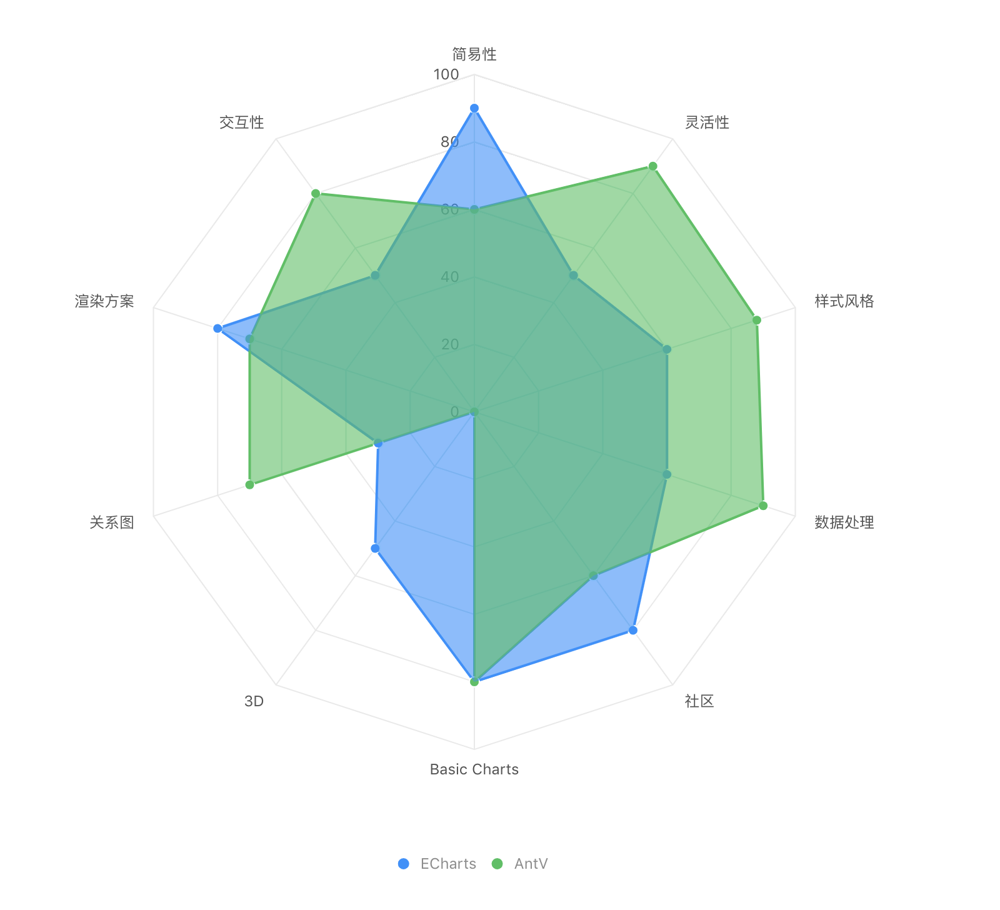

## 相关链接

[AntV](https://antv.alipay.com/zh-cn/index.html)

[Echarts](http://echarts.baidu.com/index.html)

[echarts antv 区别比较](https://www.zhihu.com/question/57388387)

[数据可视化概览](https://antv.alipay.com/zh-cn/vis/blog/vis-introduce.html)

[Compare the Best Javascript Chart Libraries](https://blog.sicara.com/compare-best-javascript-chart-libraries-2017-89fbe8cb112d)
